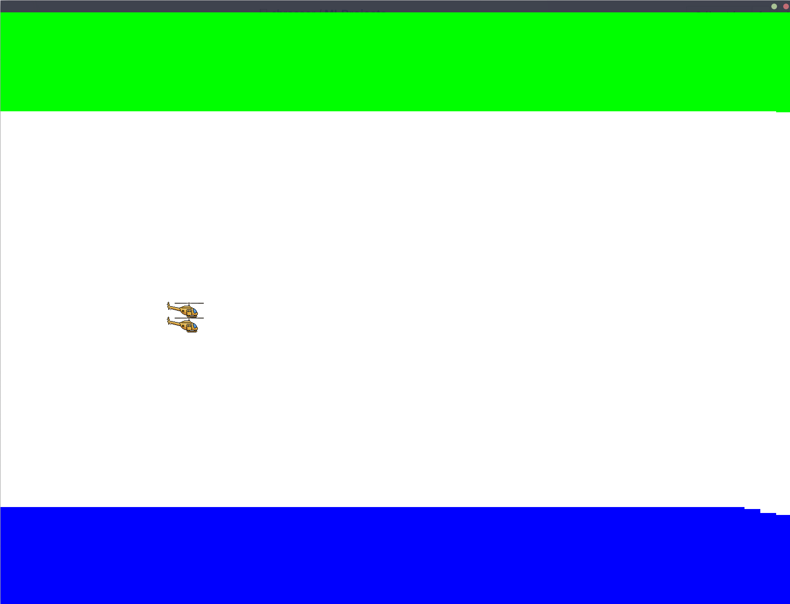

# Copter

Recreation of the classic arcade game Copter, being played by a small neural network that is used by a genetic algorithm. 
The game is made entirely in pygame and all files needed are in this directory. The game and the training can be start with the
main_file.py.

